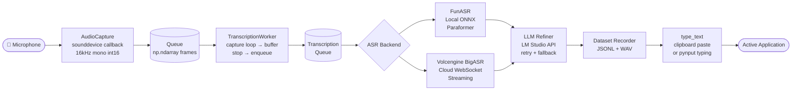
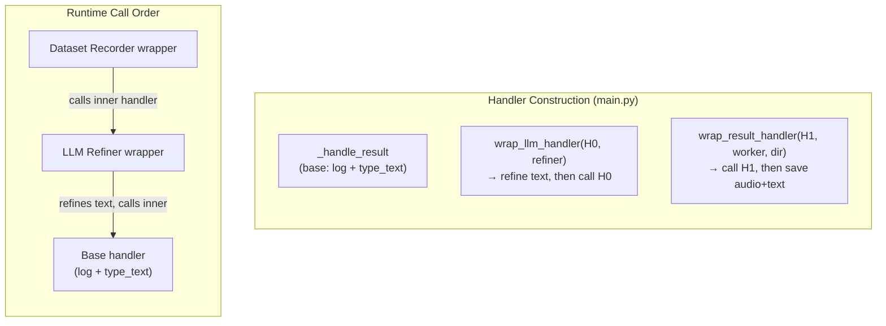
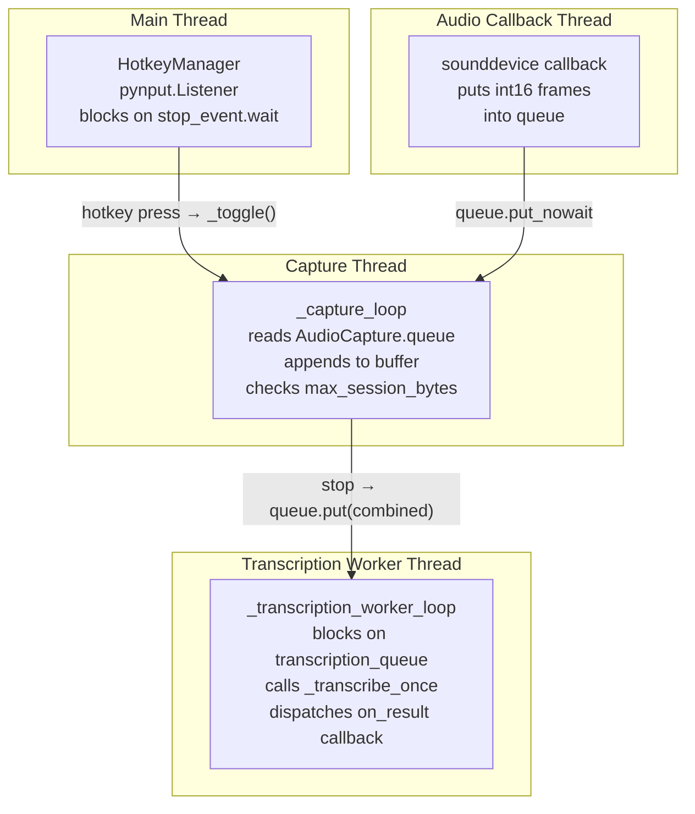
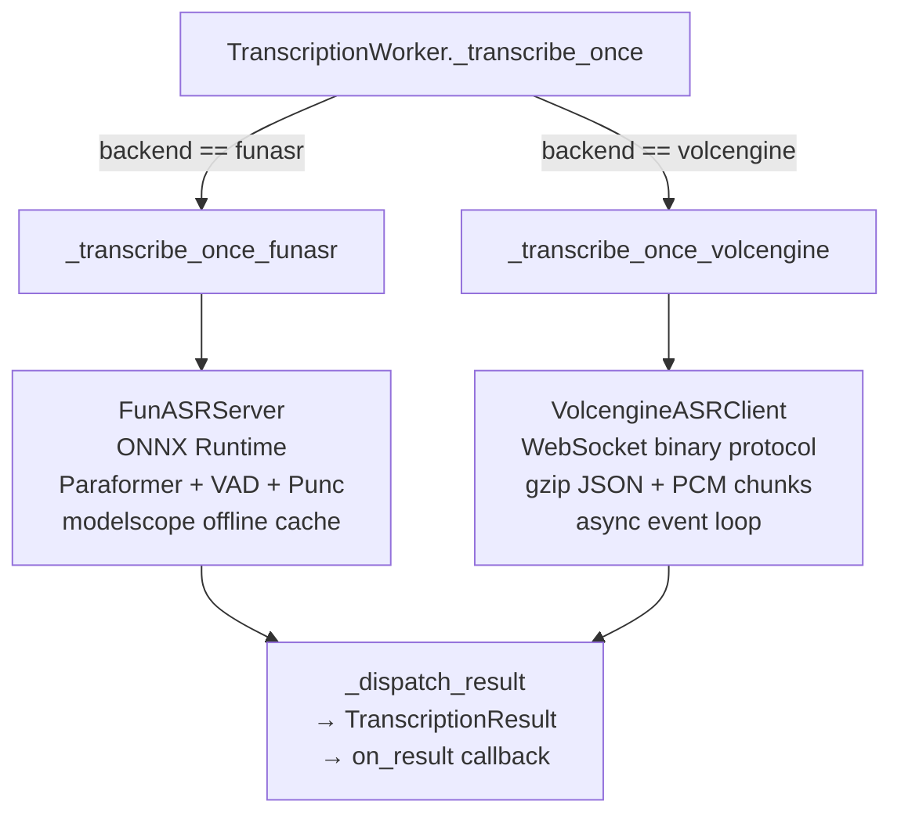
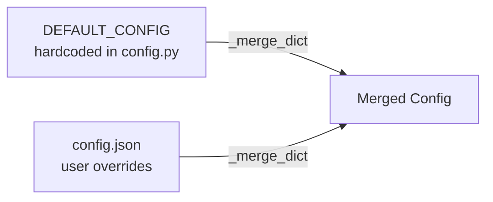

# vocotype-cli Architecture

**Local speech-to-text CLI tool that captures microphone audio, transcribes via FunASR (local ONNX) or Volcengine BigASR (cloud WebSocket), optionally refines with LLM, and injects text into the active application.**

## Architecture Pattern

Event-driven with a callback-chain plugin system. A hotkey press triggers audio capture start/stop; stopping enqueues audio for async transcription; the result flows through a chain of `wrap_result_handler` wrappers before final text injection.

## Data Flow



## Plugin Chain (Callback Wrapping)

The result handler is built inside-out. Each plugin wraps the previous handler:



**Key invariant:** Each wrapper calls the inner handler first (or modifies `result.text` before calling). Failures in any plugin are caught and logged — the original text passes through unmodified.

## Threading Model



| Thread | Role | Lifecycle |
|--------|------|-----------|
| Main | Runs `HotkeyManager.wait()`, blocks until Ctrl+C | App lifetime |
| pynput Listener | Daemon thread, fires `_on_press`/`_on_release` callbacks | App lifetime |
| sounddevice callback | OS audio thread, pushes `np.ndarray` frames to queue | While recording |
| Capture loop | Daemon thread, drains audio queue into buffer | Per recording session |
| Transcription worker | Daemon thread, processes transcription queue sequentially | App lifetime |

**Synchronization primitives:**
- `threading.Event`: `_running`, `_recording`, `_stop_requested`, `_transcription_running`
- `threading.RLock`: `_state_lock` (protects start/stop state transitions)
- `threading.Lock`: `_buffer_lock` (protects audio buffer), `_toggle_lock` (debounce)
- `queue.Queue`: audio frame queue (AudioCapture → capture loop), transcription queue (stop → worker)

## ASR Backend Abstraction

Selected by `config["backend"]`: `"funasr"` (default) or `"volcengine"`.



| | FunASR (Local) | Volcengine BigASR (Cloud) |
|---|---|---|
| Runtime | ONNX Runtime (CPU/GPU) | WebSocket streaming |
| Models | Paraformer + FSMN-VAD + CT-Punc | bigmodel (server-side) |
| Latency | ~1-3s for 10s audio | ~0.5-1s streaming |
| Privacy | Fully offline | Audio sent to cloud |
| Config section | `asr` | `volcengine` |
| Model download | `modelscope.snapshot_download` | N/A |

## Configuration

`load_config()` deep-merges `DEFAULT_CONFIG` with user's `config.json`:



**Config sections:**

| Section | Purpose |
|---------|---------|
| `hotkeys` | Toggle key combo (default: `opt_r`) |
| `audio` | Sample rate, block size, device, max session bytes |
| `vad` | Voice activity detection thresholds |
| `backend` | `"funasr"` or `"volcengine"` |
| `asr` | FunASR options: VAD, punctuation, language, hotword |
| `volcengine` | App key, access key, endpoint, chunk size, ITN |
| `output` | Dedupe, method (`auto`/`type`/`clipboard`), append newline |
| `llm` | LLM refiner: base URL, model, system prompt, timeout, retries |
| `logging` | Log directory, level |

## Error Handling

- **Plugins fail gracefully.** Both `llm_refiner` and `dataset_recorder` catch all exceptions internally and fall back to the original text or skip recording. The base handler always executes.
- **LLM Refiner** retries up to `max_retries` times with backoff. Validates output length (rejects >2× input). Returns original text on any failure.
- **Dataset Recorder** calls the inner handler first, then attempts to save. Save failures are logged and swallowed.
- **Audio capture** falls back to alternative devices if the configured device fails. Falls back to device native sample rate with post-capture resampling if 16kHz is unsupported.
- **Transcription queue** is bounded (maxsize=10). If full, the recording is dropped with an error log rather than blocking the user.
- **Hotkey toggle** is debounced (200ms) to prevent rapid double-triggers.

## Module Map

```
main.py                          # Entry point: assembles components, runs event loop
app/
├── __init__.py                  # Public API exports
├── config.py                    # DEFAULT_CONFIG + load_config + merge logic
├── audio_capture.py             # sounddevice mic capture with queue
├── transcribe.py                # TranscriptionWorker: session capture + async dispatch
├── hotkeys.py                   # HotkeyManager: pynput listener + combo parsing
├── output.py                    # type_text: clipboard paste or pynput typing
├── funasr_server.py             # FunASRServer: local ONNX inference
├── volcengine_asr.py            # VolcengineASRClient: cloud WebSocket streaming
├── funasr_config.py             # Model names and revisions
├── download_models.py           # modelscope snapshot_download with offline cache
├── logging_config.py            # TimedRotatingFileHandler setup
└── plugins/
    ├── llm_refiner.py           # LLM post-processing (LM Studio compatible API)
    └── dataset_recorder.py      # Save audio+text pairs as JSONL+WAV
tools/
├── annotate.py                  # CLI annotation tool for dataset
└── annotate_web.py              # Web UI annotation tool
```
