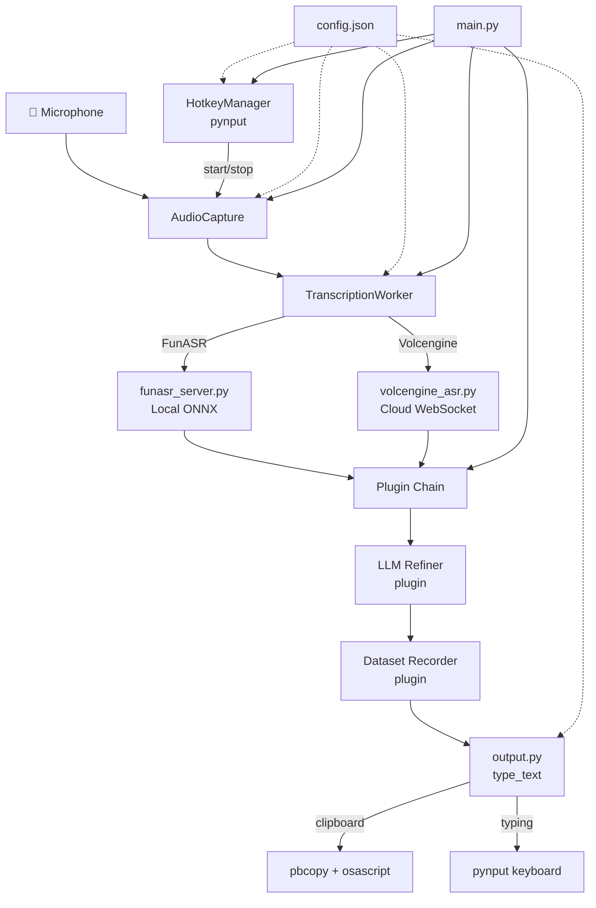

# vocotype-cli — Codebase Info

**Language:** Python 3.12+
**Type:** Local speech-to-text CLI tool
**Config:** Single `config.json` with defaults in `app/config.py`

## Repository Structure

```
vocotype-cli/
├── main.py                     # Entry point — assembles all components
├── config.json                 # User configuration (all fields have defaults)
├── Makefile                    # Build/run targets
├── app/
│   ├── config.py               # Config loading, DEFAULT_CONFIG
│   ├── audio_capture.py        # Mic recording (sounddevice, 16kHz mono)
│   ├── transcribe.py           # TranscriptionWorker — thread pool + queue
│   ├── funasr_server.py        # FunASR local ONNX backend
│   ├── volcengine_asr.py       # Volcengine BigASR cloud WebSocket backend
│   ├── hotkeys.py              # HotkeyManager (pynput, modifier combos)
│   ├── output.py               # Text output (clipboard paste / pynput typing)
│   └── plugins/
│       ├── llm_refiner.py      # LLM post-processing with retry
│       └── dataset_recorder.py # Save audio+text pairs (JSONL + WAV)
├── tools/
│   ├── annotate.py             # CLI annotation tool
│   └── annotate_web.py         # Web annotation UI
└── docs/
    ├── llm-refiner.md          # LLM refiner prompt design & API format
    ├── plugin-guide.md         # How to write plugins
    ├── sft-guide.md            # ASR fine-tuning workflow
    └── volcengine.md           # Volcengine ASR integration
```

## Technology Stack

| Category | Libraries |
|----------|-----------|
| Audio capture | sounddevice, librosa, soundfile |
| ASR (local) | funasr_onnx (Paraformer ONNX) |
| ASR (cloud) | websockets (Volcengine BigASR) |
| Text processing | jieba |
| Hotkeys | pynput |
| Output | pyperclip, pynput, pbcopy+osascript (macOS) |
| Model management | modelscope (snapshot_download, offline-first) |
| Logging | stdlib logging, TimedRotatingFileHandler (daily, 3 backups) |

## Module Map



## Entry Points

| Command | Description |
|---------|-------------|
| `make install` | Install dependencies |
| `make run` | Start vocotype-cli |
| `make run-save` | Start with dataset recording enabled |
| `make annotate` | Launch CLI annotation tool |
| `make funasr` | Start FunASR server |
| `make download-models` | Download ASR models via modelscope |
| `make clean` | Clean generated files |
| `python main.py` | Direct entry point |

## Configuration Overview

`config.json` sections:

| Section | Purpose |
|---------|---------|
| `hotkeys` | Key combos for start/stop recording |
| `audio` | Sample rate (16kHz), channels (mono), device selection |
| `vad` | Voice activity detection parameters |
| `backend` | ASR backend selection (`funasr` or `volcengine`) |
| `asr` | FunASR model paths and parameters |
| `volcengine` | Volcengine API credentials and endpoint |
| `output` | Output method (clipboard / typing) |
| `llm` | LLM refiner API endpoint, model, prompt |
| `logging` | Log level, file path, rotation settings |

## Plugin Mechanism

Plugins use the `wrap_result_handler` pattern to form a callback chain:

```
ASR result → LLM Refiner → Dataset Recorder → type_text
```

Each plugin wraps the next handler, enabling pre/post-processing of transcription results.

## Data & SFT Workflow

- **Dataset format:** JSONL with paired WAV audio files
- **Annotation:** CLI (`tools/annotate.py`) or Web UI (`tools/annotate_web.py`)
- **SFT pipeline:** Collect data → Annotate → Fine-tune Paraformer model
