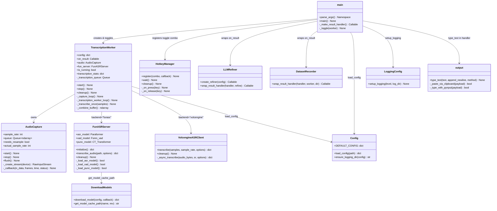

# vocotype-cli — Major Components

## Component Relationship Diagram



## Data Flow

```
Mic → AudioCapture._callback → queue → TranscriptionWorker._capture_loop → buffer
  → stop() → _combine_buffer [resample if needed] → _transcription_queue
  → _transcription_worker_loop → FunASR/Volcengine → TranscriptionResult
  → [LLM Refiner wrap] → [Dataset Recorder wrap] → type_text → clipboard/keyboard
```

---

## 1. main.py — CLI Entry Point

**Purpose:** Assembles all modules, registers the hotkey, builds the plugin chain, and runs the event loop.

**Key functions:**
- `parse_args()` — CLI flags: `--config`, `--once`, `--save-dataset`, `--dataset-dir`
- `main()` — Loads config, creates `TranscriptionWorker`, wraps `on_result` with LLM refiner then dataset recorder, registers hotkey via `HotkeyManager`, blocks on `hotkeys.wait()`
- `_make_result_handler(output_method, append_newline, worker)` — Creates the base callback that logs stats and calls `type_text`
- `_toggle(worker)` — Debounced (200ms) start/stop toggle with `threading.Lock`

**Plugin chain assembly order:**
1. Base handler (`_make_result_handler`) → calls `type_text`
2. `wrap_llm_handler(handler, refiner)` → LLM refines `result.text` before base handler
3. `wrap_result_handler(handler, worker, dataset_dir)` → saves audio+text after base handler

**Threading:** Main thread blocks on `HotkeyManager.wait()`. Cleanup on `KeyboardInterrupt` stops worker, cleans up hotkeys.

**Dependencies:** `app` package (all core modules), `app.plugins.llm_refiner`, `app.plugins.dataset_recorder`, `app.logging_config`

---

## 2. AudioCapture (`app/audio_capture.py`)

**Purpose:** Captures raw PCM audio from the microphone via `sounddevice.RawInputStream` and enqueues frames for consumption.

**Class: `AudioCapture`**

| Method | Description |
|--------|-------------|
| `__init__(sample_rate, block_ms, device, queue_size=200)` | Configures target sample rate, block size, and bounded queue |
| `start()` | Opens stream; falls back to device native rate if target rate unsupported, then to any available input device |
| `stop()` | Stops and closes the stream |
| `flush()` | Drains the queue |
| `needs_resample` | Property: `True` if actual rate ≠ target rate |
| `actual_sample_rate` | Property: the rate the hardware is actually using |

**Internal:**
- `_create_stream(device)` — Tries target rate first, then device native rate. Returns `sd.RawInputStream`.
- `_callback(in_data, frames, time, status)` — Stream callback, copies `int16` frame into queue. Drops frames on `queue.Full`.
- `_get_device_native_rate(device)` — Queries `sd.query_devices` for default sample rate.
- `_fallback_device()` — Scans all devices for any with input channels.

**Threading:** The `_callback` runs on sounddevice's audio thread. Queue is thread-safe (`queue.Queue`). `start()`/`stop()` are protected by `threading.Lock`.

**Dependencies:** `sounddevice`, `numpy`

---

## 3. TranscriptionWorker (`app/transcribe.py`)

**Purpose:** Core orchestrator. Manages recording sessions (start/stop), buffers audio, submits to an async transcription queue, dispatches results through the callback chain.

**Class: `TranscriptionWorker`**

| Method | Description |
|--------|-------------|
| `__init__(config_path, on_result)` | Loads config, creates `AudioCapture`, initializes ASR backend (FunASR or Volcengine), starts transcription worker thread |
| `start()` | Begins a new recording session: clears buffer, starts audio capture, spawns capture thread |
| `stop()` | Stops recording, combines buffer (with optional resample via librosa), submits to transcription queue |
| `cleanup()` | Stops everything: recording, transcription worker thread, audio capture, ASR backend |
| `transcription_stats` | Property: `{submitted, completed, pending, is_recording, is_transcribing}` |

**Session lifecycle:**
1. `start()` → sets `_running` event, clears buffer, starts `AudioCapture`, spawns `_capture_loop` thread
2. `_capture_loop` → reads from `AudioCapture.queue`, appends to `_buffer`, checks `max_session_bytes` limit (auto-stops if exceeded)
3. `stop()` → stops audio, joins capture thread, calls `_combine_buffer()` (concatenates + optional librosa resample), puts result on `_transcription_queue`
4. `_transcription_worker_loop` (daemon thread) → dequeues samples, calls `_transcribe_once` → `_dispatch_result` → `on_result` callback

**Dual backend support:**
- `_transcribe_once_funasr(samples)` — Writes temp WAV, calls `FunASRServer.transcribe_audio`, deletes temp file
- `_transcribe_once_volcengine(samples)` — Calls `VolcengineASRClient.transcribe` directly with numpy array

**Threading:**
- `_capture_loop` — daemon thread, reads audio queue
- `_transcription_worker_loop` — daemon thread, processes transcription queue (maxsize=10)
- `_state_lock` (RLock) protects session state
- `_buffer_lock` (Lock) protects audio buffer
- `_stop_requested` event prevents duplicate stops

**Dependencies:** `numpy`, `librosa` (optional, for resample), `wave`, `tempfile`, `AudioCapture`, `FunASRServer`, `VolcengineASRClient`, `config`

---

## 4. FunASRServer (`app/funasr_server.py`)

**Purpose:** Local offline ASR using Paraformer ONNX models from ModelScope. Loads ASR, VAD, and punctuation models. Also serves as a standalone CLI for file transcription.

**Class: `FunASRServer`**

| Method | Description |
|--------|-------------|
| `__init__()` | Reads model config from `funasr_config.py`, selects device (CPU/CUDA via `FUNASR_DEVICE` env) |
| `initialize()` | Parallel model loading via threads. Pre-imports `funasr_onnx` submodules to avoid import deadlocks. Warms up librosa. |
| `transcribe_audio(audio_path, options)` | Full pipeline: optional VAD → ASR (Paraformer ONNX) → optional punctuation restoration → result dict |
| `cleanup()` | Nullifies model references, runs `gc.collect()` |

**Models (from `funasr_config.py`):**
- ASR: `iic/speech_paraformer-large_asr_nat-zh-cn-16k-common-vocab8404-onnx` (Paraformer)
- VAD: `iic/speech_fsmn_vad_zh-cn-16k-common-onnx` (FSMN)
- Punc: `iic/punc_ct-transformer_zh-cn-common-vocab272727-onnx` (CT-Transformer)

**Model loading:**
- `_load_asr_model()` — `funasr_onnx.paraformer_bin.Paraformer`, supports quantized model, configurable thread count via `OMP_NUM_THREADS`
- `_load_vad_model()` — `funasr_onnx.vad_bin.Fsmn_vad`, controlled by `FUNASR_USE_VAD` env (default: off)
- `_load_punc_model()` — `funasr_onnx.punc_bin.CT_Transformer`, controlled by `FUNASR_USE_PUNC` env (default: on)

**Threading:** `initialize()` loads all models in parallel threads (5-min timeout each). Memory cleanup every 10 transcriptions.

**CLI mode:** `python -m app.funasr_server --audio file.wav [--no-vad] [--no-punc] [--pretty]`

**Dependencies:** `funasr_onnx`, `librosa`, `modelscope` (for download), `app.download_models`, `app.funasr_config`

---

## 5. VolcengineASRClient (`app/volcengine_asr.py`)

**Purpose:** Cloud streaming ASR via Volcengine BigASR WebSocket binary protocol.

**Class: `VolcengineASRClient`**

| Method | Description |
|--------|-------------|
| `__init__(config)` | Reads `app_key`, `access_key`, `resource_id`, `url`, `model_name`, `chunk_ms`, `enable_punc`, `enable_itn` |
| `transcribe(samples, sample_rate, options)` | Sync wrapper: converts samples to int16 PCM, runs `_async_transcribe` in a new event loop |
| `cleanup()` | No-op (stateless WebSocket connections) |

**Binary protocol (module-level helpers):**
- `_build_header(message_type, flags)` — 4-byte header: version, message type, serialization, compression
- `_build_full_client_request(payload_dict, sequence)` — JSON + gzip init packet
- `_build_audio_packet(audio_data, is_last)` — Gzip-compressed PCM chunk, last-packet flag
- `_parse_server_response(data)` — Parses server response/error packets

**Async flow (`_async_transcribe`):**
1. Connect to `wss://openspeech.bytedance.com/api/v3/sauc/bigmodel` with auth headers
2. Send `FULL_CLIENT_REQUEST` (audio format + model config)
3. Receive init ACK
4. Concurrently: stream audio chunks (`chunk_ms` intervals) + receive incremental results
5. Return final accumulated text on `is_last_package`

**Threading:** Creates a new `asyncio` event loop per call (runs in transcription worker thread). Audio sending and result receiving are concurrent `asyncio` tasks.

**Dependencies:** `websockets`, `asyncio`, `gzip`, `numpy`, `uuid`

---

## 6. HotkeyManager (`app/hotkeys.py`)

**Purpose:** Global hotkey registration and detection using `pynput.keyboard.Listener`.

**Class: `HotkeyManager`**

| Method | Description |
|--------|-------------|
| `register(combo, callback)` | Parses combo string, stores `(modifiers, trigger, callback)`, starts listener on first call |
| `wait()` | Blocks on `threading.Event` until `cleanup()` is called |
| `unregister_all()` | Clears all registered combos |
| `cleanup()` | Unregisters all, sets stop event, stops pynput listener |

**Combo parsing (`_parse_combo`):**
- Splits on `+`, maps each part to `pynput.keyboard.Key` or `KeyCode`
- Supports: F1–F20, modifiers (ctrl/alt/opt/option/shift/cmd with l/r variants), single chars
- Single modifier (e.g. `alt_r`) treated as trigger with no required modifiers
- Multi-modifier without explicit trigger: last part becomes trigger

**Key matching:**
- `_on_press` tracks pressed modifiers, checks if trigger matches and all required modifiers are held
- `_on_release` removes modifiers from pressed set
- `_key_matches` handles `Key`, `KeyCode`, and canonical forms

**Threading:** `pynput.Listener` runs its own daemon thread. Callbacks execute on that thread. `_lock` protects combo registration.

**Dependencies:** `pynput`

---

## 7. output.py — Text Injection

**Purpose:** Injects recognized text into the active application via clipboard paste or character typing.

**Functions:**

| Function | Description |
|----------|-------------|
| `type_text(text, append_newline, method)` | Main entry. Tries methods in priority order based on platform and `method` config |
| `_paste_via_clipboard(payload)` | macOS: `pbcopy` → `osascript` Cmd+V → restore clipboard. Others: `pyperclip` + pynput Cmd/Ctrl+V |
| `_type_with_pynput(payload)` | `pynput.keyboard.Controller.type()` — unreliable for CJK on macOS |
| `_emit_paste()` | Simulates Cmd+V (macOS) or Ctrl+V via pynput |

**Method priority:**
- macOS default (`auto`): clipboard paste first, pynput fallback
- macOS `type`: pynput first, clipboard fallback
- Other platforms: pynput first, clipboard fallback

**Clipboard restore:** Saves previous clipboard content before paste, restores after 150ms delay.

**Threading:** Called from the transcription worker thread. `subprocess.run` calls are synchronous with timeouts.

**Dependencies:** `subprocess` (pbcopy/pbpaste/osascript on macOS), `pynput`, `pyperclip` (non-macOS)

---

## 8. LLM Refiner (`app/plugins/llm_refiner.py`)

**Purpose:** Post-processes ASR text through a local LLM (LM Studio compatible API) to remove filler words, fix grammar, and add punctuation.

**Functions:**

| Function | Description |
|----------|-------------|
| `create_refiner(config)` | Returns a `refine(text) → str` closure if `llm.enabled`, else `None` |
| `wrap_result_handler(handler, refine)` | Wraps handler to refine `result.text` before passing through |

**Refiner behavior (`refine` closure):**
1. Calls `POST /v1/chat/completions` with system prompt + ASR text, `temperature=0`
2. Retries up to `max_retries` times (configurable, default 1) with backoff (`0.5s × attempt`, max 2s)
3. Anti-hallucination guards:
   - Strips common LLM prefixes (`Output:`, `精炼:`, etc.)
   - Rejects empty results → returns original
   - Rejects outputs >2× input length + 20 chars → returns original ("跑飞" detection)
4. On total failure → returns original text (never blocks output)

**Default system prompt:** Instructs LLM to act as ASR post-processor only — delete fillers, merge repeats, fix grammar, preserve meaning, output plain text with no commentary.

**Threading:** Runs synchronously in the transcription worker thread. `urllib.request.urlopen` with configurable timeout.

**Dependencies:** `urllib.request` (stdlib), `json`, `re`

---

## 9. Dataset Recorder (`app/plugins/dataset_recorder.py`)

**Purpose:** Best-effort persistence of audio+text pairs for SFT training data collection.

**Function: `wrap_result_handler(handler, worker, dataset_dir)`**

Returns a wrapped handler that:
1. Calls the original handler first (ensures normal output is unaffected)
2. On success: copies `worker.last_segment_path` (recent.wav) to `dataset/audio/{id}.wav` via atomic copy (tmp + `os.replace`)
3. Appends JSONL record to `dataset/dataset.jsonl`

**Record format (JSONL):**
```json
{
  "id": "20260429_012041_123456-a1b2c3d4",
  "audio": "audio/20260429_012041_123456-a1b2c3d4.wav",
  "text": "refined text",
  "raw_text": "original ASR text",
  "duration": 3.5,
  "sample_rate": 16000,
  "inference_latency": 1.2,
  "confidence": 0.95,
  "timestamp": "2026-04-29T01:20:41Z"
}
```

**Error handling:** All save failures are logged and swallowed — never interrupts the normal result flow.

**Threading:** Runs in the transcription worker thread. File I/O is synchronous.

**Dependencies:** `json`, `shutil`, `uuid`, `pathlib`

---

## 10. Annotation Tools (`tools/`)

### `tools/annotate.py` — CLI Annotation

**Purpose:** Terminal-based tool for human correction of ASR transcriptions.

**Workflow:**
1. Loads `dataset/dataset.jsonl`, skips already-annotated IDs (from `dataset/annotated.jsonl`)
2. For each sample: plays audio via `afplay` (macOS), shows ASR text, prompts for correction
3. Commands: Enter=accept, `r`=replay, `s`=skip, `d`=mark dirty (empty text), `q`=quit
4. Saves to `dataset/annotated.jsonl`

**Dependencies:** `readline` (line editing), `subprocess` (afplay)

### `tools/annotate_web.py` — Web Annotation UI

**Purpose:** Browser-based annotation interface served via built-in `http.server`.

**Features:**
- `GET /` — Serves embedded HTML/JS single-page app
- `GET /api/records` — Returns all records with annotation status
- `GET /audio/{path}` — Serves WAV files from dataset directory
- `POST /api/annotate` — Saves annotation

**Usage:** `python tools/annotate_web.py [--port 8686] [--dataset-dir dataset]`

**Dependencies:** `http.server` (stdlib only, no external deps)

---

## 11. Config (`app/config.py`)

**Purpose:** Single-source configuration with deep-merge defaults.

**Functions:**

| Function | Description |
|----------|-------------|
| `load_config(path)` | Loads JSON file, deep-merges with `DEFAULT_CONFIG`. Returns defaults if no path. |
| `ensure_logging_dir(config)` | Creates log directory (relative to project root), returns absolute path |

**`DEFAULT_CONFIG` sections:**

| Section | Key settings |
|---------|-------------|
| `hotkeys` | `toggle`: `"opt_r"` |
| `audio` | `sample_rate`: 16000, `block_ms`: 20, `max_session_bytes`: 20MB |
| `vad` | Thresholds for start/stop, min speech/silence durations |
| `backend` | `"funasr"` or `"volcengine"` |
| `asr` | `use_vad`, `use_punc`, `language`, `hotword`, `batch_size_s` |
| `volcengine` | `app_key`, `access_key`, `resource_id`, `url`, `model_name`, `chunk_ms`, `enable_punc`, `enable_itn` |
| `output` | `method` (auto/type), `append_newline`, `dedupe`, `min_chars` |
| `llm` | `enabled`, `base_url`, `model`, `system_prompt`, `timeout` |
| `logging` | `dir`: `"logs"`, `level`: `"INFO"` |

**Merge strategy:** `_merge_dict` recursively merges dicts; scalar values in overrides replace defaults.

**Dependencies:** `json`, `os` (stdlib only)

---

## 12. Logging (`app/logging_config.py`)

**Purpose:** Single configuration point for the entire project's logging.

**Function: `setup_logging(level, log_dir)`**

- Console: `StreamHandler` to stderr (avoids stdout interference)
- File (optional): `TimedRotatingFileHandler` — daily rotation at midnight, 3 backups, UTF-8
- File naming: `log_YYYY-MM-DD.log`
- Format: `%(asctime)s [%(levelname)s] %(name)s: %(message)s`
- Idempotent: clears existing handlers before configuring

**Threading:** Safe — `logging` module handles thread safety internally.

**Dependencies:** `logging` (stdlib only)

---

## 13. Model Download (`app/download_models.py`)

**Purpose:** Parallel download of FunASR ONNX models from ModelScope with offline-first caching.

**Functions:**

| Function | Description |
|----------|-------------|
| `download_model(config, callback)` | Downloads a single model via `modelscope.snapshot_download`, reports progress |
| `get_model_cache_path(name, revision)` | Offline-first: checks `~/.cache/modelscope/hub/models/iic/{name}` for existing `.onnx` files, falls back to `snapshot_download` |
| `main()` | CLI entry: parallel download of all 3 models (ASR, VAD, Punc) with JSON progress output |

**Cache strategy (`get_model_cache_path`):**
1. Check `~/.cache/modelscope/hub/models/iic/{short_name}/` for `model_quant.onnx` or `model.onnx`
2. If found → return path immediately (no network)
3. If not → try `snapshot_download(local_files_only=True)` (offline mode)
4. If offline fails → `snapshot_download()` (online download)

**Threading:** `main()` spawns one daemon thread per model, joins all. Progress tracked with lock-protected counters.

**Dependencies:** `modelscope.hub.snapshot_download`, `app.funasr_config`
