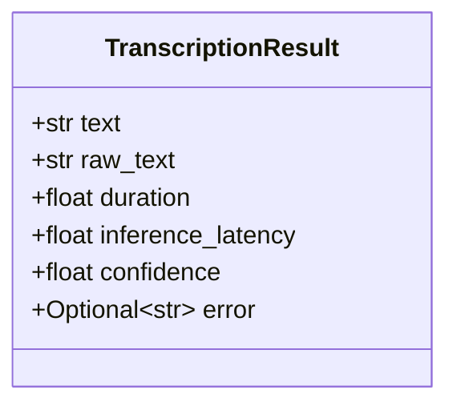
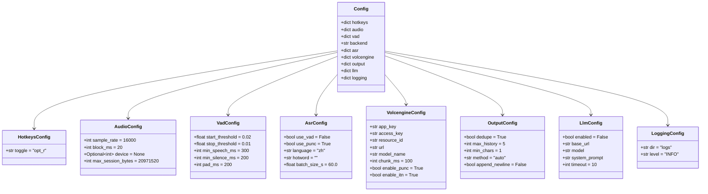
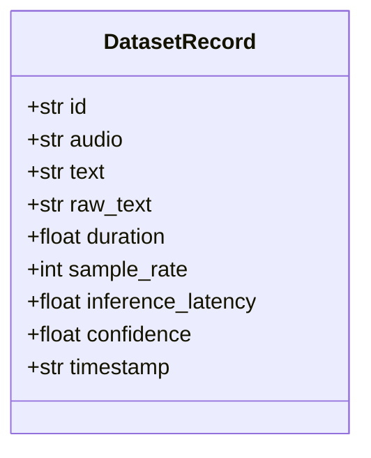
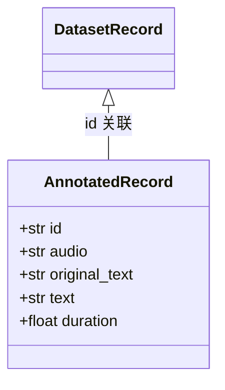
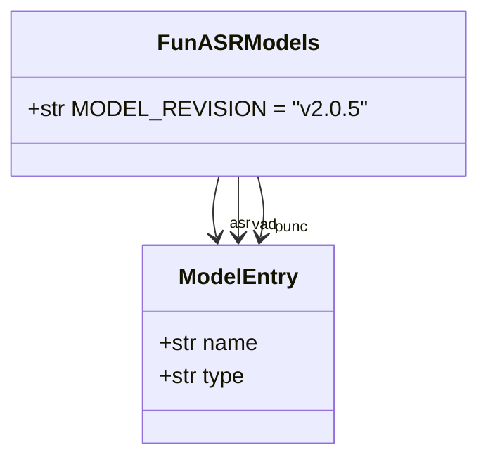
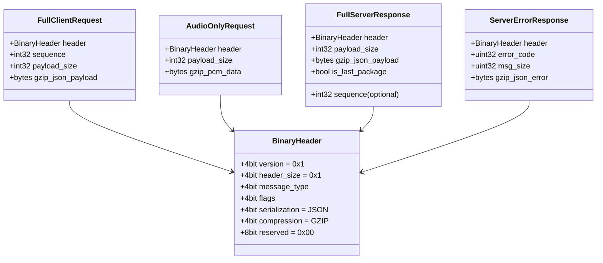
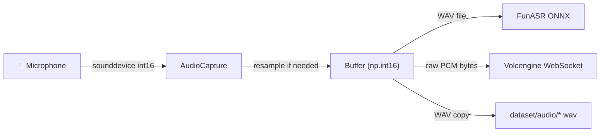

# Data Models — vocotype-cli

本文档描述 vocotype-cli 中所有核心数据结构、配置格式和协议定义。

---

## 1. TranscriptionResult

`app/transcribe.py` 中的 `@dataclass`，是 ASR 转录结果在应用层的统一表示。由 `TranscriptionWorker._dispatch_result()` 构造，传递给插件链回调。

```python
@dataclass
class TranscriptionResult:
    text: str                    # 最终文本（经标点恢复 / LLM 后处理）
    raw_text: str                # ASR 原始输出（无标点）
    duration: float              # 音频时长（秒）
    inference_latency: float     # 推理耗时（秒）
    confidence: float            # 置信度 0.0–1.0
    error: Optional[str] = None  # 非 None 表示转录失败
```



---

## 2. Config Structure

`app/config.py` 中的 `DEFAULT_CONFIG` dict，通过 `load_config()` 与用户 `config.json` 深度合并。

### 2.1 顶层结构

| Key | Type | Default | 说明 |
|-----|------|---------|------|
| `hotkeys` | dict | — | 热键配置 |
| `audio` | dict | — | 音频采集参数 |
| `vad` | dict | — | VAD 阈值（FunASR 用） |
| `backend` | str | `"funasr"` | ASR 后端：`funasr` 或 `volcengine` |
| `asr` | dict | — | FunASR 识别选项 |
| `volcengine` | dict | — | 火山引擎 BigASR 配置 |
| `output` | dict | — | 文本输出行为 |
| `llm` | dict | — | LLM 后处理配置 |
| `logging` | dict | — | 日志配置 |

### 2.2 各节详细字段

#### hotkeys

| Field | Type | Default | 说明 |
|-------|------|---------|------|
| `toggle` | str | `"opt_r"` | 录音切换热键 |

#### audio

| Field | Type | Default | 说明 |
|-------|------|---------|------|
| `sample_rate` | int | `16000` | 采样率 (Hz) |
| `block_ms` | int | `20` | 音频块时长 (ms) |
| `device` | int \| None | `None` | sounddevice 设备索引 |
| `max_session_bytes` | int | `20971520` | 单次录音最大字节数 (20 MB) |

#### vad

| Field | Type | Default | 说明 |
|-------|------|---------|------|
| `start_threshold` | float | `0.02` | 语音起始能量阈值 |
| `stop_threshold` | float | `0.01` | 语音结束能量阈值 |
| `min_speech_ms` | int | `300` | 最短语音段 (ms) |
| `min_silence_ms` | int | `200` | 最短静音段 (ms) |
| `pad_ms` | int | `200` | 前后填充 (ms) |

#### asr (FunASR)

| Field | Type | Default | 说明 |
|-------|------|---------|------|
| `use_vad` | bool | `False` | 是否启用 VAD 前处理 |
| `use_punc` | bool | `True` | 是否启用标点恢复 |
| `language` | str | `"zh"` | 识别语言 |
| `hotword` | str | `""` | 热词字符串 |
| `batch_size_s` | float | `60.0` | 动态 batch 总时长 (秒) |

#### volcengine

| Field | Type | Default | 说明 |
|-------|------|---------|------|
| `app_key` | str | `""` | 火山引擎应用 Key |
| `access_key` | str | `""` | 火山引擎 Access Key |
| `resource_id` | str | `"volc.bigasr.sauc.duration"` | 计费资源 ID |
| `url` | str | `"wss://openspeech.bytedance.com/api/v3/sauc/bigmodel"` | WebSocket 端点 |
| `model_name` | str | `"bigmodel"` | 识别模型名称 |
| `chunk_ms` | int | `100` | 每帧音频时长 (ms) |
| `enable_punc` | bool | `True` | 是否添加标点 |
| `enable_itn` | bool | `True` | 是否启用数字/格式规范化 |

#### output

| Field | Type | Default | 说明 |
|-------|------|---------|------|
| `dedupe` | bool | `True` | 去重连续相同结果 |
| `max_history` | int | `5` | 去重历史窗口大小 |
| `min_chars` | int | `1` | 最少字符数才输出 |
| `method` | str | `"auto"` | 输出方式：`auto` / `clipboard` / `typing` |
| `append_newline` | bool | `False` | 输出后是否追加换行 |

#### llm

| Field | Type | Default | 说明 |
|-------|------|---------|------|
| `enabled` | bool | `False` | 是否启用 LLM 后处理 |
| `base_url` | str | `"http://localhost:1234"` | LLM API 地址 |
| `model` | str | `""` | 模型名称 |
| `system_prompt` | str | `""` | 系统提示词 |
| `timeout` | int | `10` | 请求超时 (秒) |

#### logging

| Field | Type | Default | 说明 |
|-------|------|---------|------|
| `dir` | str | `"logs"` | 日志目录（相对于项目根） |
| `level` | str | `"INFO"` | 日志级别 |



---

## 3. Dataset JSONL Record

`app/plugins/dataset_recorder.py` 中 `wrap_result_handler` 写入 `dataset/dataset.jsonl` 的每行记录。

```json
{
  "id": "20240101_120000_123456-a1b2c3d4",
  "audio": "audio/20240101_120000_123456-a1b2c3d4.wav",
  "text": "你好世界。",
  "raw_text": "你好世界",
  "duration": 2.5,
  "sample_rate": 16000,
  "inference_latency": 0.83,
  "confidence": 0.95,
  "timestamp": "2024-01-01T12:00:00Z"
}
```

| Field | Type | 说明 |
|-------|------|------|
| `id` | str | `{UTC时间戳}_{微秒}-{uuid4前8位}` |
| `audio` | str | 相对于 dataset 目录的 WAV 路径 |
| `text` | str | 最终文本（含标点 / LLM 后处理） |
| `raw_text` | str | ASR 原始输出 |
| `duration` | float | 音频时长 (秒) |
| `sample_rate` | int | 采样率，固定 16000 |
| `inference_latency` | float | 推理耗时 (秒) |
| `confidence` | float | 置信度 0.0–1.0 |
| `timestamp` | str | UTC ISO 8601 时间戳 |



---

## 4. Annotated JSONL Record

`tools/annotate.py` 写入 `dataset/annotated.jsonl` 的每行记录，用于 SFT 微调训练。

```json
{
  "id": "20240101_120000_123456-a1b2c3d4",
  "audio": "audio/20240101_120000_123456-a1b2c3d4.wav",
  "original_text": "你好世界。",
  "text": "你好，世界。",
  "duration": 2.5
}
```

| Field | Type | 说明 |
|-------|------|------|
| `id` | str | 与 dataset.jsonl 中的 id 对应 |
| `audio` | str | 相对 WAV 路径 |
| `original_text` | str | ASR 原始识别文本 |
| `text` | str | 人工修正后的文本 |
| `duration` | float | 音频时长 (秒) |



---

## 5. ASR Result Dict

`FunASRServer.transcribe_audio()` 和 `VolcengineASRClient.transcribe()` 返回的统一 dict 格式。由 `TranscriptionWorker._dispatch_result()` 消费并转换为 `TranscriptionResult`。

### 成功

```python
{
    "success": True,
    "text": "你好，世界。",       # 含标点的最终文本
    "raw_text": "你好世界",       # 无标点原始文本
    "duration": 2.5,             # 音频时长 (秒)
    "confidence": 0.95,          # 置信度
    # FunASR 额外字段：
    "language": "zh-CN",
    "model_type": "onnx",
    "models": {"asr": "...", "vad": "...", "punc": "..."},
    # Volcengine 额外字段：
    "inference_latency": 0.83,   # 端到端耗时 (秒)
}
```

### 失败

```python
{
    "success": False,
    "error": "错误描述",
    "type": "transcription_error",  # FunASR 特有
}
```

| Field | Type | 必须 | 说明 |
|-------|------|------|------|
| `success` | bool | ✓ | 是否成功 |
| `text` | str | 成功时 | 最终文本 |
| `raw_text` | str | 成功时 | 原始文本 |
| `duration` | float | 成功时 | 音频时长 (秒) |
| `confidence` | float | 成功时 | 置信度 |
| `error` | str | 失败时 | 错误信息 |
| `type` | str | 失败时 | 错误类型（FunASR） |
| `inference_latency` | float | Volcengine | 端到端耗时 |

---

## 6. FunASR Model Config

`app/funasr_config.py` 定义模型名称和版本，支持环境变量覆盖。

```python
MODEL_REVISION = "v2.0.5"  # 可通过 FUNASR_MODEL_REVISION 覆盖

MODELS = {
    "asr": {
        "name": "iic/speech_paraformer-large_asr_nat-zh-cn-16k-common-vocab8404-onnx",
        "type": "asr",
    },
    "vad": {
        "name": "iic/speech_fsmn_vad_zh-cn-16k-common-onnx",
        "type": "vad",
    },
    "punc": {
        "name": "iic/punc_ct-transformer_zh-cn-common-vocab272727-onnx",
        "type": "punc",
    },
}
```

| 模型 | 环境变量 | 默认 ModelScope ID | 用途 |
|------|---------|-------------------|------|
| ASR | `FUNASR_ASR_MODEL` | `iic/speech_paraformer-large_asr_nat-zh-cn-16k-common-vocab8404-onnx` | Paraformer 语音识别 |
| VAD | `FUNASR_VAD_MODEL` | `iic/speech_fsmn_vad_zh-cn-16k-common-onnx` | FSMN 语音活动检测 |
| Punc | `FUNASR_PUNC_MODEL` | `iic/punc_ct-transformer_zh-cn-common-vocab272727-onnx` | CT-Transformer 标点恢复 |



---

## 7. Volcengine Binary Protocol

`app/volcengine_asr.py` 实现的 BigASR WebSocket 二进制协议。

### 7.1 Header 格式 (4 bytes)

```
Byte 0: [version:4][header_size:4]   → 0x11 (version=1, size=1×4 bytes)
Byte 1: [message_type:4][flags:4]
Byte 2: [serialization:4][compression:4] → 0x11 (JSON + gzip)
Byte 3: reserved (0x00)
```

### 7.2 Message Types

| 值 | 常量 | 方向 | 说明 |
|----|------|------|------|
| `0b0001` | `FULL_CLIENT_REQUEST` | C→S | 初始化请求（JSON payload + sequence） |
| `0b0010` | `AUDIO_ONLY_REQUEST` | C→S | 音频数据帧 |
| `0b1001` | `FULL_SERVER_RESPONSE` | S→C | 识别结果 |
| `0b1111` | `SERVER_ERROR_RESPONSE` | S→C | 错误响应 |

### 7.3 Flags

| 值 | 常量 | 说明 |
|----|------|------|
| `0b0000` | `NO_SEQUENCE` | 无序列号，非最后一包 |
| `0b0001` | (POS_SEQUENCE) | 有序列号 |
| `0b0010` | `NEG_SEQUENCE` | 最后一包（bit-1 置位） |

### 7.4 Packet Layout

**FULL_CLIENT_REQUEST:**
```
[header:4][sequence:4 big-endian][payload_size:4 big-endian][gzip(json):N]
```

**AUDIO_ONLY_REQUEST:**
```
[header:4][payload_size:4 big-endian][gzip(pcm_bytes):N]
```

**FULL_SERVER_RESPONSE:**
```
[header:4][sequence?:4][payload_size:4 big-endian][gzip(json):N]
```

**SERVER_ERROR_RESPONSE:**
```
[header:4][error_code:4 big-endian][msg_size:4 big-endian][gzip(json):N]
```

### 7.5 Init Payload (JSON)

```json
{
  "audio": {
    "format": "pcm",
    "codec": "raw",
    "sample_rate": 16000,
    "channel": 1
  },
  "request": {
    "model_name": "bigmodel",
    "enable_punc": true,
    "enable_itn": true
  }
}
```

### 7.6 Server Response Payload (JSON)

```json
{
  "result": { "text": "识别文本" },
  "audio_info": { "duration": 2500 }
}
```



---

## 8. Audio Format

整个系统统一使用以下音频格式：

| 属性 | 值 |
|------|-----|
| 采样率 | 16000 Hz |
| 声道数 | 1 (mono) |
| 位深度 | 16-bit signed integer (int16) |
| 容器 | WAV (RIFF) |
| 字节序 | little-endian (WAV 标准) |
| 每秒字节数 | 32000 (16000 × 2) |

音频在以下环节保持此格式：
- `AudioCapture` 采集（sounddevice，如设备采样率不同则通过 librosa 重采样至 16kHz）
- 临时 WAV 文件写入（`TranscriptionWorker._write_temp_wav()`）
- FunASR 本地识别输入
- Volcengine 流式发送（raw PCM bytes，无 WAV 头）
- Dataset 保存（`dataset/audio/*.wav`）


