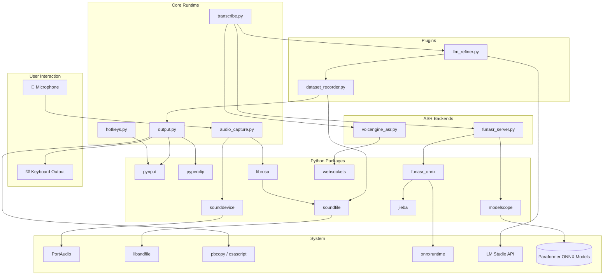

# Dependencies — vocotype-cli

## Python Packages (requirements.txt)

| Package | Version | Purpose | Used By |
|---------|---------|---------|---------|
| **sounddevice** | `==0.5.2` | Audio capture via `RawInputStream` with callback; reads PCM frames from microphone | `app/audio_capture.py` |
| **pynput** | `==1.8.1` | Global hotkey listening (`keyboard.Listener`) and character-by-character text typing (`keyboard.Controller`); also simulates Cmd/Ctrl+V paste | `app/hotkeys.py`, `app/output.py` |
| **pyperclip** | `==1.11.0` | Cross-platform clipboard read/write; used as fallback on non-macOS platforms where `pbcopy`/`pbpaste` are unavailable | `app/output.py` (non-macOS path) |
| **librosa** | `==0.11.0` | Audio resampling when the microphone's native sample rate differs from the required 16 kHz | `app/audio_capture.py` |
| **soundfile** | `==0.13.1` | Audio file I/O (WAV read/write); also a runtime dependency of librosa | `app/transcribe.py`, `app/plugins/dataset_recorder.py` |
| **funasr_onnx** | `==0.4.1` | FunASR ONNX runtime for local offline ASR inference — bundles Paraformer (speech recognition), FSMN-VAD (voice activity detection), and CT-Transformer (punctuation restoration) | `app/funasr_server.py` |
| **jieba** | `==0.42.1` | Chinese word segmentation; used internally by FunASR for tokenization | `funasr_onnx` (transitive) |
| **websockets** | `>=12.0` | WebSocket client for Volcengine BigASR streaming protocol; only needed when `backend == "volcengine"` | `app/volcengine_asr.py` |
| **modelscope** | `==1.30.0` | Model hub client; `snapshot_download` fetches and caches Paraformer ONNX models (~500 MB) on first run | `app/download_models.py`, `app/funasr_server.py` |

### Transitive Dependencies (notable)

| Package | Pulled By | Notes |
|---------|-----------|-------|
| `numpy` | librosa, funasr_onnx | Array operations for audio buffers |
| `onnxruntime` | funasr_onnx | ONNX inference engine; CPU by default, GPU via `onnxruntime-gpu` |
| `cffi`, `libsndfile` | soundfile | C FFI bindings to libsndfile for WAV codec |
| `scipy` | librosa | Signal processing primitives |

## System Dependencies

| Dependency | Platform | Purpose |
|------------|----------|---------|
| **Python 3.12+** | All | Runtime; project uses modern syntax and typing features |
| **pbcopy / pbpaste** | macOS | Clipboard read/write for text injection (ships with macOS) |
| **osascript** | macOS | AppleScript bridge to simulate Cmd+V keystroke via System Events |
| **PortAudio** | All | Native audio I/O library; required by sounddevice (`brew install portaudio` on macOS) |
| **libsndfile** | All | Audio codec library; required by soundfile (`brew install libsndfile` on macOS) |
| **Microphone access** | All | OS-level permission; macOS prompts on first use via System Settings → Privacy → Microphone |
| **Accessibility access** | macOS | Required by pynput for global hotkey listening and keystroke simulation; grant in System Settings → Privacy → Accessibility |

## Optional Dependencies

| Dependency | Purpose | When Needed |
|------------|---------|-------------|
| **LM Studio** (or any OpenAI-compatible API server) | LLM post-processing — corrects spoken filler words, grammar, and formatting | When `llm.enabled == true` in config.json; connects to `llm.base_url` (default `http://localhost:1234`) |
| **torch + torchaudio** | GPU-accelerated ASR inference | Only if switching from ONNX to PyTorch Paraformer backend (not default) |
| **Flask** | Web annotation UI server | When running `tools/annotate_web.py` (`make annotate`) |

## Models (Downloaded at Runtime)

| Model | Size | Source | Cache Location |
|-------|------|--------|----------------|
| Paraformer-large (ONNX) | ~500 MB | ModelScope (`iic/speech_paraformer-large_asr_nat-zh-cn-16k-common-vocab8404-onnx`) | `~/.cache/modelscope/` |
| FSMN-VAD (ONNX) | ~5 MB | ModelScope | `~/.cache/modelscope/` |
| CT-Transformer Punctuation (ONNX) | ~300 MB | ModelScope | `~/.cache/modelscope/` |

Models are downloaded once via `make download-models` or automatically on first ASR invocation. Subsequent runs use the local cache (offline-first).

## Dependency Relationship Diagram



## Installation

```bash
# Install system dependencies (macOS)
brew install portaudio libsndfile

# Create venv and install Python packages
make install

# Download ASR models (~500 MB, one-time)
make download-models

# Grant macOS permissions:
# - System Settings → Privacy & Security → Microphone → Terminal/iTerm
# - System Settings → Privacy & Security → Accessibility → Terminal/iTerm
```
