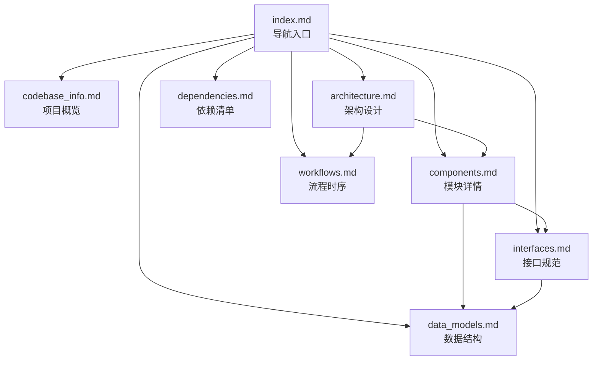

# vocotype-cli 文档索引

> 本文件是 AI 助手的主要上下文入口。将此文件加入上下文即可高效导航整个文档体系。

## 项目简介

vocotype-cli 是一个本地语音输入 CLI 工具：热键触发录音 → ASR 转文字 → 可选 LLM 精炼 → 注入到当前应用。支持 FunASR 本地离线和火山引擎云端两种 ASR 后端。

## 文档地图

| 文件 | 内容 | 何时查阅 |
|------|------|----------|
| [codebase_info.md](codebase_info.md) | 项目元数据、目录结构、技术栈、入口点 | 初次了解项目、定位文件 |
| [architecture.md](architecture.md) | 系统架构、数据流、线程模型、插件机制、错误处理 | 理解设计决策、修改核心流程 |
| [components.md](components.md) | 13 个模块的职责、关键方法、线程行为、依赖关系 | 修改特定模块、理解模块交互 |
| [interfaces.md](interfaces.md) | 插件接口、ASR 后端接口、配置接口、CLI 参数、Makefile | 添加插件、对接新后端、修改配置 |
| [data_models.md](data_models.md) | 数据结构、配置字段、JSONL 格式、二进制协议 | 修改数据格式、理解配置项 |
| [workflows.md](workflows.md) | 9 个关键流程的时序图和流程图 | 调试问题、理解执行顺序 |
| [dependencies.md](dependencies.md) | Python 依赖、系统依赖、模型资源 | 环境搭建、依赖升级 |
| [review_notes.md](review_notes.md) | 文档一致性和完整性检查结果 | 改进文档质量 |

## 快速查询指南

**"这个模块是做什么的？"** → [components.md](components.md)

**"数据是怎么流转的？"** → [architecture.md](architecture.md) 的数据流图，或 [workflows.md](workflows.md) 的时序图

**"如何添加新插件？"** → [interfaces.md](interfaces.md) 的插件接口，以及项目 docs/plugin-guide.md

**"config.json 有哪些字段？"** → [data_models.md](data_models.md) 的配置结构

**"项目用了哪些库？"** → [dependencies.md](dependencies.md)

**"某个流程的执行顺序？"** → [workflows.md](workflows.md)

## 文件间关系

## 项目源码导航

| 目标 | 关键文件 |
|------|----------|
| CLI 入口 | `main.py` |
| 核心调度 | `app/transcribe.py` |
| 音频采集 | `app/audio_capture.py` |
| 本地 ASR | `app/funasr_server.py` |
| 云端 ASR | `app/volcengine_asr.py` |
| 热键管理 | `app/hotkeys.py` |
| 文本注入 | `app/output.py` |
| LLM 后处理 | `app/plugins/llm_refiner.py` |
| 数据集采集 | `app/plugins/dataset_recorder.py` |
| 配置系统 | `app/config.py` |
| 标注工具 | `tools/annotate_web.py`, `tools/annotate.py` |
