# vocotype-cli — APIs & Interfaces

## Data Flow Overview

```mermaid
sequenceDiagram
    participant Mic
    participant AC as AudioCapture
    participant TW as TranscriptionWorker
    participant ASR as ASR Backend<br/>(FunASR / Volcengine)
    participant LLM as LLM Refiner
    participant DR as Dataset Recorder
    participant Out as type_text

    Mic->>AC: sounddevice callback (int16 frames)
    AC->>AC: queue.put_nowait(frame)
    TW->>AC: capture_loop reads queue
    TW->>TW: buffer.append(frame)
    Note over TW: User presses hotkey → stop()
    TW->>TW: combine_buffer() → np.ndarray
    TW->>TW: transcription_queue.put(samples)
    TW->>ASR: transcribe (file path or samples)
    ASR-->>TW: {success, text, raw_text, duration, confidence}
    TW->>TW: wrap as TranscriptionResult
    TW->>LLM: on_result(result) [if enabled]
    LLM->>LLM: POST /v1/chat/completions
    LLM-->>TW: result.text = refined
    TW->>DR: on_result(result) [if --save-dataset]
    DR->>DR: copy WAV + append JSONL
    TW->>Out: on_result(result)
    Out->>Out: pbcopy + osascript Cmd+V
```



---

## 1. Plugin Interface

Plugins use the **wrap_result_handler** decorator pattern to form a callback chain. Each wrapper receives the next handler and returns a new callable with the same `(TranscriptionResult) -> None` signature.

### TranscriptionResult

```python
# app/transcribe.py
@dataclass
class TranscriptionResult:
    text: str                        # Final text (after punctuation / LLM refine)
    raw_text: str                    # Raw ASR output before post-processing
    duration: float                  # Audio duration in seconds
    inference_latency: float         # ASR inference wall-clock seconds
    confidence: float                # ASR confidence score (0.0–1.0)
    error: Optional[str] = None      # Non-None on failure
```

### wrap_result_handler (dataset_recorder)

```python
# app/plugins/dataset_recorder.py
def wrap_result_handler(
    handler: Callable[[TranscriptionResult], None],
    worker: TranscriptionWorker,   # for last_segment_path access
    dataset_dir: str,              # output directory, e.g. "dataset"
) -> Callable[[TranscriptionResult], None]:
```

- Calls `handler(result)` first, then saves audio + JSONL record.
- Best-effort: save failures are logged but swallowed.

### wrap_result_handler (llm_refiner)

```python
# app/plugins/llm_refiner.py
def wrap_result_handler(
    handler: Callable[[TranscriptionResult], None],
    refine: Callable[[str], str],  # from create_refiner()
) -> Callable[[TranscriptionResult], None]:
```

- Mutates `result.text = refine(result.text)` before calling `handler(result)`.
- Skipped when `result.error` is set or `result.text` is empty.

### Plugin Chain Assembly (main.py)

```python
worker.on_result = _make_result_handler(output_method, append_newline, worker)
refiner = create_refiner(config)
if refiner:
    worker.on_result = wrap_llm_handler(worker.on_result, refiner)
if args.save_dataset:
    worker.on_result = wrap_result_handler(worker.on_result, worker, args.dataset_dir)
```

Execution order (innermost first): **ASR → LLM Refiner → Dataset Recorder → type_text**.

---

## 2. ASR Backend Interface

Both backends return a common result dict consumed by `TranscriptionWorker._dispatch_result()`.

### Common Result Dict

```python
{
    "success": bool,
    "text": str,           # Final text (with punctuation)
    "raw_text": str,       # Text before punctuation restoration
    "duration": float,     # Audio duration in seconds
    "confidence": float,   # 0.0–1.0
    "error": str,          # Present only when success=False
}
```

### FunASR (local offline ONNX)

```python
# app/funasr_server.py
class FunASRServer:
    def initialize(self) -> dict:
        """Load ASR/VAD/PUNC ONNX models in parallel threads.
        Returns: {"success": bool, "message"|"error": str}
        """

    def transcribe_audio(
        self,
        audio_path: str,           # Path to 16kHz mono WAV file
        options: Optional[dict] = None,
    ) -> dict:
        """Transcribe a WAV file. Returns common result dict.
        
        Options keys:
            batch_size_s: float  (default 60)
            hotword: str         (default "")
            use_vad: bool        (default from env FUNASR_USE_VAD)
            use_punc: bool       (default from env FUNASR_USE_PUNC)
            language: str        (default "zh")
        """

    def cleanup(self) -> None:
        """Release model references and run gc.collect()."""
```

### Volcengine BigASR (cloud WebSocket streaming)

```python
# app/volcengine_asr.py
class VolcengineASRClient:
    def __init__(self, config: Dict[str, Any]) -> None:
        """Config keys: app_key, access_key, resource_id, url,
        model_name, chunk_ms, enable_punc, enable_itn."""

    def transcribe(
        self,
        samples: np.ndarray,       # int16 or float32 1-D array
        sample_rate: int = 16000,
        options: Optional[Dict[str, Any]] = None,
    ) -> Dict[str, Any]:
        """Synchronous transcribe via async WebSocket internally.
        Returns common result dict + inference_latency field.
        
        Options keys:
            enable_punc: bool
            enable_itn: bool
        """

    def cleanup(self) -> None:
        """No-op (stateless WebSocket per call)."""
```

### WebSocket Binary Protocol (Volcengine)

| Packet Type | Code | Direction | Description |
|---|---|---|---|
| FULL_CLIENT_REQUEST | `0b0001` | Client→Server | JSON init payload (audio format, model config) |
| AUDIO_ONLY_REQUEST | `0b0010` | Client→Server | Gzipped PCM chunks; last packet sets NEG_SEQUENCE flag |
| FULL_SERVER_RESPONSE | `0b1001` | Server→Client | JSON with `result.text` and `audio_info.duration` |
| SERVER_ERROR_RESPONSE | `0b1111` | Server→Client | Error code + JSON error message |

---

## 3. Configuration Interface

```python
# app/config.py
def load_config(path: Optional[str] = None) -> Dict[str, Any]:
    """Load config JSON, deep-merged over DEFAULT_CONFIG.
    Returns full config dict with all defaults filled in.
    Raises FileNotFoundError if path is given but missing."""

def _merge_dict(base: Dict[str, Any], overrides: Dict[str, Any]) -> Dict[str, Any]:
    """Recursive deep merge. Override scalars replace; dicts merge recursively."""

def ensure_logging_dir(config: Dict[str, Any]) -> str:
    """Create logging dir (relative to project root) and return absolute path."""
```

### DEFAULT_CONFIG Structure

```python
{
    "hotkeys": {"toggle": "opt_r"},
    "audio": {
        "sample_rate": 16000,
        "block_ms": 20,
        "device": None,
        "max_session_bytes": 20971520,  # 20 MB
    },
    "vad": {
        "start_threshold": 0.02,
        "stop_threshold": 0.01,
        "min_speech_ms": 300,
        "min_silence_ms": 200,
        "pad_ms": 200,
    },
    "backend": "funasr",              # "funasr" | "volcengine"
    "asr": {
        "use_vad": False,
        "use_punc": True,
        "language": "zh",
        "hotword": "",
        "batch_size_s": 60.0,
    },
    "volcengine": {
        "app_key": "",
        "access_key": "",
        "resource_id": "volc.bigasr.sauc.duration",
        "url": "wss://openspeech.bytedance.com/api/v3/sauc/bigmodel",
        "model_name": "bigmodel",
        "chunk_ms": 100,
        "enable_punc": True,
        "enable_itn": True,
    },
    "output": {
        "dedupe": True,
        "max_history": 5,
        "min_chars": 1,
        "method": "auto",             # "auto" | "type" | "clipboard"
        "append_newline": False,
    },
    "llm": {
        "enabled": False,
        "base_url": "http://localhost:1234",
        "model": "",
        "system_prompt": "",           # Falls back to DEFAULT_PROMPT
        "timeout": 10,
    },
    "logging": {"dir": "logs", "level": "INFO"},
}
```

---

## 4. Audio Interface

```python
# app/audio_capture.py
class AudioCapture:
    def __init__(
        self,
        sample_rate: int,              # Target sample rate (16000)
        block_ms: int,                 # Frame duration in ms (20)
        device: Optional[str] = None,  # sounddevice device name/index
        queue_size: int = 200,
    ) -> None: ...

    @property
    def queue(self) -> queue.Queue[np.ndarray]:
        """Frame queue. Each item is int16 1-D ndarray."""

    @property
    def needs_resample(self) -> bool:
        """True if actual device rate differs from target."""

    @property
    def actual_sample_rate(self) -> int:
        """The sample rate the device is actually using."""

    def start(self) -> None:
        """Open mic stream. Flushes queue first. Falls back to alternate device on error."""

    def stop(self) -> None:
        """Stop and close the stream."""

    def flush(self) -> None:
        """Drain all pending frames from the queue."""
```

Audio format throughout the pipeline: **16 kHz, mono, int16 PCM (WAV)**.

If the device doesn't support 16 kHz, AudioCapture records at the device's native rate and `TranscriptionWorker._combine_buffer()` resamples via `librosa.resample()`.

---

## 5. HotkeyManager Interface

```python
# app/hotkeys.py
class HotkeyManager:
    def register(self, combo: str, callback: Callable[[], None]) -> None:
        """Register a hotkey combo. Starts pynput Listener on first call.
        
        combo format: "f2", "ctrl+shift+a", "opt_r", "cmd+k"
        Supported modifier names: ctrl, alt, opt, option, shift, cmd
            (each with _l / _r variants)
        Single modifier (e.g. "opt_r") is treated as the trigger key.
        """

    def wait(self) -> None:
        """Block until cleanup() is called (replaces keyboard.wait())."""

    def unregister_all(self) -> None:
        """Remove all registered combos."""

    def cleanup(self) -> None:
        """Unregister all combos, stop listener, unblock wait()."""
```

---

## 6. Output Interface

```python
# app/output.py
def type_text(
    text: str,
    append_newline: bool = False,
    method: str = "auto",
) -> None:
    """Inject text into the active application.
    
    method:
        "auto"  — macOS: clipboard paste first, fallback pynput.type()
                   other: pynput.type() first, fallback clipboard
        "type"  — pynput character-by-character typing (unreliable for CJK on macOS)
        other   — clipboard paste first
    
    macOS clipboard paste flow:
        1. pbpaste → save previous clipboard
        2. pbcopy  → write payload
        3. osascript → keystroke "v" using command down
        4. sleep 0.15s
        5. pbcopy  → restore previous clipboard
    """
```

---

## 7. LLM API (External)

The LLM refiner calls any **OpenAI Chat Completions–compatible** endpoint.

### Request

```
POST {base_url}/v1/chat/completions
Content-Type: application/json

{
    "model": "<config.llm.model>",
    "messages": [
        {"role": "system", "content": "<system_prompt>"},
        {"role": "user",   "content": "<asr_text>"}
    ],
    "temperature": 0
}
```

### Response (expected)

```json
{
    "choices": [
        {"message": {"content": "<refined_text>"}}
    ]
}
```

### Retry & Safety

- Retries: `1 + max_retries` attempts (default `max_retries=1`, so 2 total).
- Backoff: `min(attempt * 0.5, 2)` seconds between retries.
- Output validation: if refined text is empty or > `2× input length + 20` chars, falls back to original text.
- Strips common LLM prefixes matching `^(Output|Result|精炼|输出)[：:]`.
- On total failure, returns original ASR text unchanged.

---

## 8. CLI Interface

```
usage: main.py [-h] [--config CONFIG] [--once] [--save-dataset] [--dataset-dir DATASET_DIR]

Arguments:
  --config CONFIG          Path to config JSON (default: uses DEFAULT_CONFIG)
  --once                   Single transcription cycle then exit (debug mode)
  --save-dataset           Enable dataset recording (audio + JSONL pairs)
  --dataset-dir DIR        Dataset output directory (default: "dataset")
```

### FunASR Standalone CLI

```
usage: python -m app.funasr_server [-h] --audio AUDIO [--no-vad] [--no-punc]
                                   [--language LANG] [--hotword HOTWORD]
                                   [--batch-size-s FLOAT] [--pretty]

Outputs JSON result to stdout. Exit code: 0=success, 1=init failure, 2=transcription failure.
```

### Dataset JSONL Format

Each line in `dataset/dataset.jsonl`:

```json
{
    "id": "20260429_012041_123456-a1b2c3d4",
    "audio": "audio/20260429_012041_123456-a1b2c3d4.wav",
    "text": "最终文本",
    "raw_text": "ASR原始文本",
    "duration": 3.5,
    "sample_rate": 16000,
    "inference_latency": 0.82,
    "confidence": 0.95,
    "timestamp": "2026-04-29T01:20:41Z"
}
```

---

## 9. Makefile Interface

| Target | Command | Description |
|---|---|---|
| `help` | — | Show all targets with descriptions |
| `install` | `python3 -m venv .venv && pip install -r requirements.txt` | Create venv and install deps |
| `run` | `python main.py --config config.json` | Start speech-to-text with hotkey toggle |
| `run-save` | `python main.py --config config.json --save-dataset` | Start with dataset recording enabled |
| `annotate` | `python tools/annotate_web.py --port 8686` | Launch web annotation UI |
| `funasr` | `python -m app.funasr_server` | Start FunASR standalone server |
| `download-models` | `python -m app.download_models` | Download ASR models via modelscope |
| `clean` | `rm -rf logs/*.log* app/__pycache__ tools/__pycache__` | Remove logs and bytecode cache |

Variables: `PYTHON` (default `python3`), `VENV` (default `.venv`), `CONFIG` (default `config.json`), `PORT` (default `8686`).

---

## 10. TranscriptionWorker Internal Interface

```python
# app/transcribe.py
class TranscriptionWorker:
    def __init__(
        self,
        config_path: Optional[str] = None,
        on_result: Optional[Callable[[TranscriptionResult], None]] = None,
    ) -> None: ...

    def start(self) -> None:
        """Begin recording. Clears buffer, starts AudioCapture + capture thread."""

    def stop(self) -> None:
        """Stop recording, combine buffer, submit to async transcription queue."""

    def cleanup(self) -> None:
        """Release all resources: stop recording, stop worker thread, cleanup ASR backend."""

    @property
    def is_running(self) -> bool: ...

    @property
    def is_transcribing(self) -> bool:
        """True if transcription queue is non-empty."""

    @property
    def pending_transcriptions(self) -> int: ...

    @property
    def transcription_stats(self) -> dict:
        """{"submitted": int, "completed": int, "pending": int,
            "is_recording": bool, "is_transcribing": bool}"""
```

The worker uses a background daemon thread (`_transcription_worker_loop`) reading from a bounded `queue.Queue(maxsize=10)`. Recording and transcription are fully decoupled — the user can start a new recording while a previous transcription is still processing.
