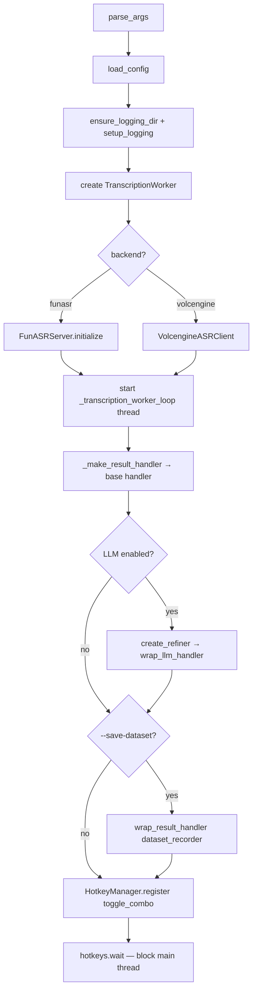
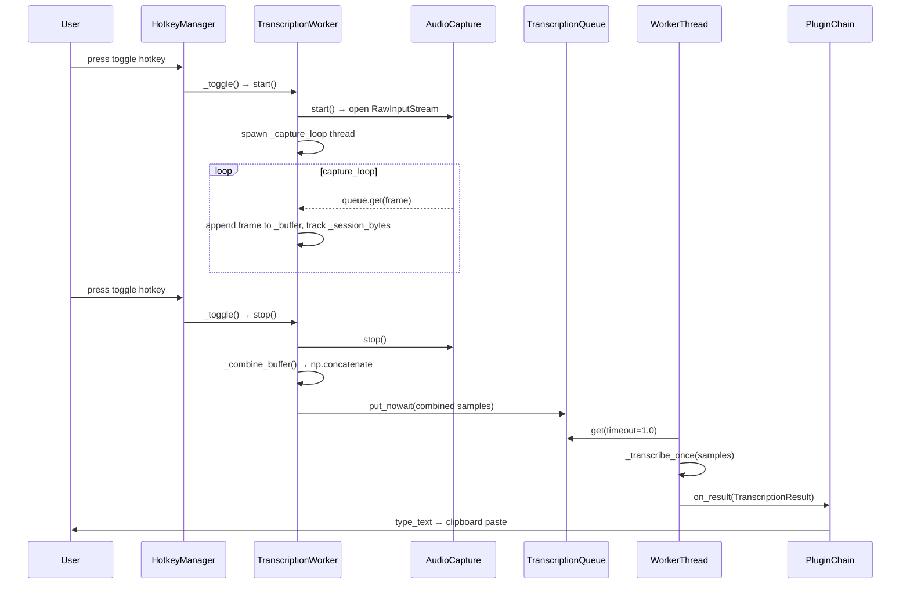
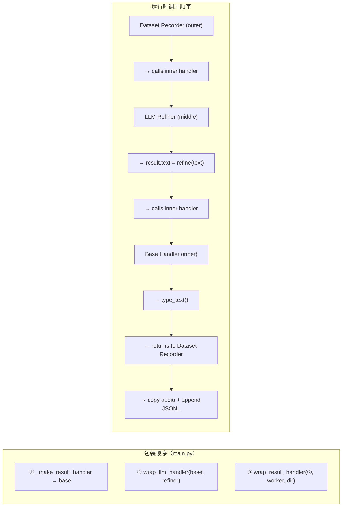
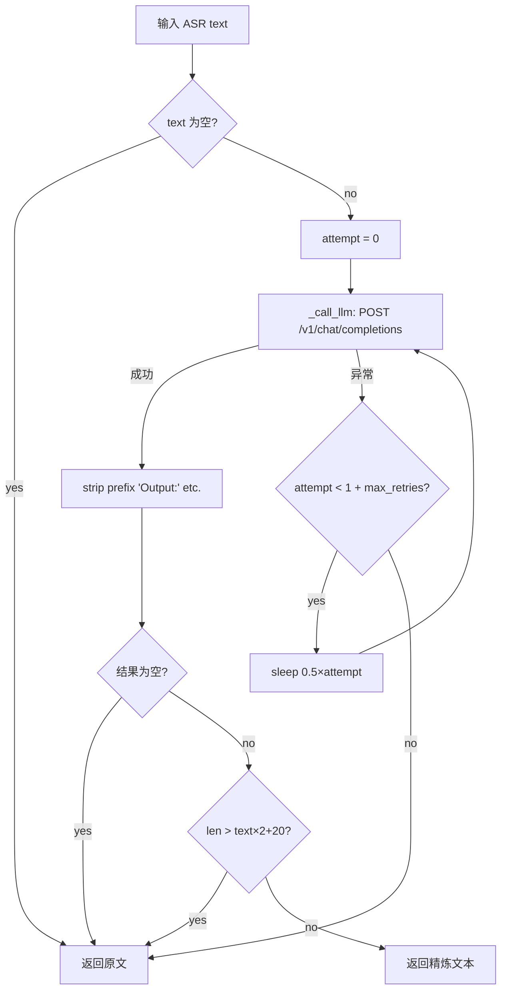
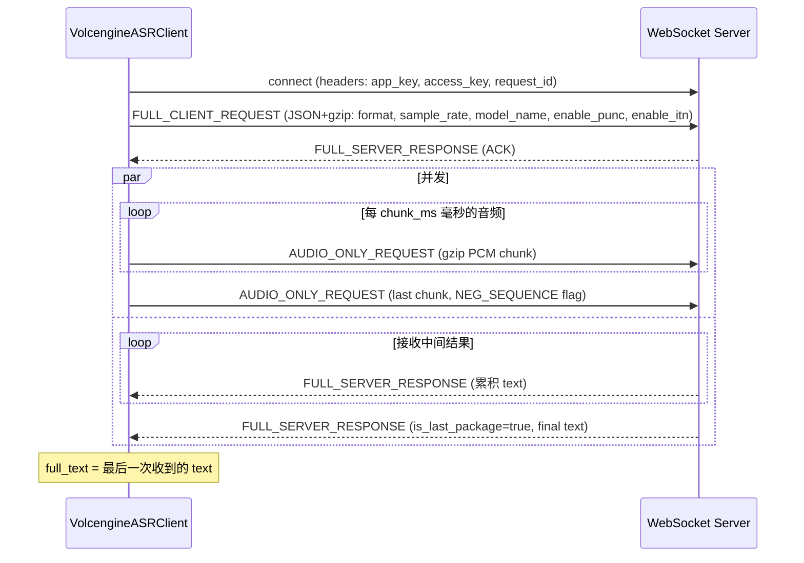
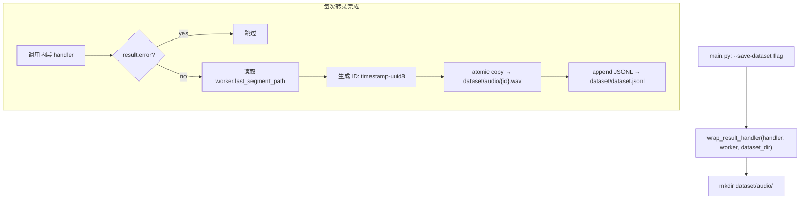
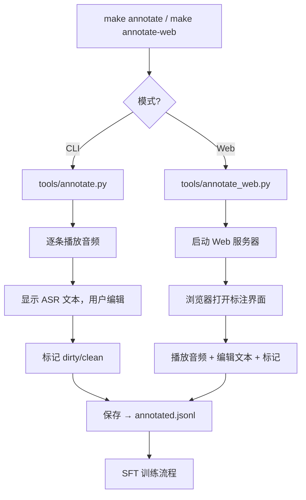
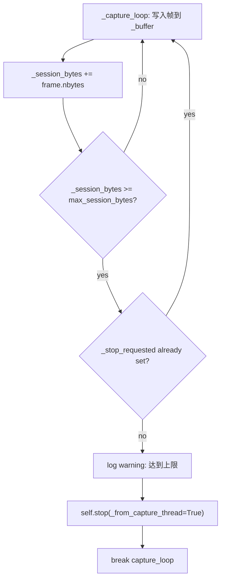
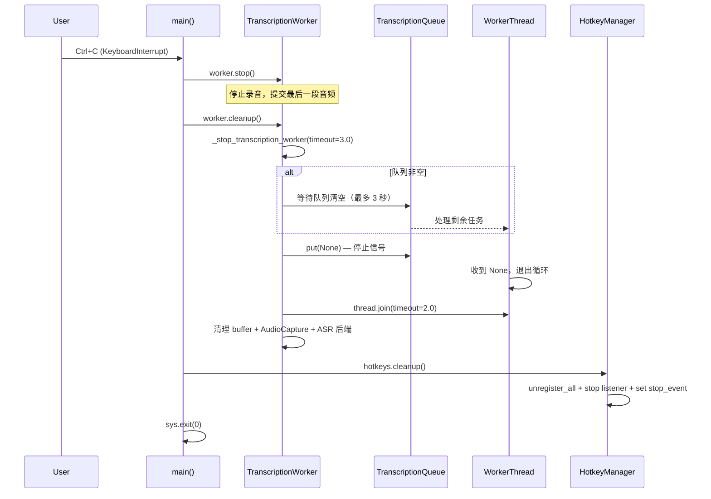

# Workflows

vocotype-cli 核心工作流文档。每个流程附 Mermaid 图和关键代码入口。

---

## 1. Startup Flow

`main.py:main()` 按顺序初始化所有子系统，最后阻塞等待热键事件。



**关键入口：**
- `main.py:main()` — 启动编排
- `app/config.py:load_config()` — 配置加载与默认值合并
- `app/transcribe.py:TranscriptionWorker.__init__()` — 后端初始化 + 转录线程启动

---

## 2. Recording & Transcription

热键触发录音开关。录音期间 capture 线程持续填充缓冲区；停止后音频提交到异步转录队列。



**关键入口：**
- `main.py:_toggle()` — 防抖 + 录音开关
- `app/transcribe.py:TranscriptionWorker.start()` / `stop()` — 录音生命周期
- `app/transcribe.py:TranscriptionWorker._capture_loop()` — 音频帧采集
- `app/transcribe.py:TranscriptionWorker._transcription_worker_loop()` — 异步转录消费

---

## 3. Plugin Chain Execution

插件通过 `wrap_result_handler` 层层包装回调，形成洋葱模型。包装顺序决定执行顺序。



**执行语义：**
- **LLM Refiner**（中间层）：修改 `result.text` 后传递给内层
- **Dataset Recorder**（外层）：先调用内层 handler（确保文本已精炼+输出），再保存音频和文本

**关键入口：**
- `app/plugins/llm_refiner.py:wrap_result_handler()` — 文本精炼包装
- `app/plugins/dataset_recorder.py:wrap_result_handler()` — 数据集记录包装

---

## 4. LLM Refinement

ASR 原始文本经 LLM 去除口语词、修正语病，支持重试和安全回退。



**校验规则：**
1. 空结果 → 回退原文
2. 输出长度 > 原文×2+20 → 疑似跑飞，回退原文
3. 去除 `Output:`/`精炼:`/`输出:` 等前缀

**关键入口：**
- `app/plugins/llm_refiner.py:create_refiner()` — 创建闭包
- `app/plugins/llm_refiner.py:refine()` — 重试+校验逻辑

---

## 5. Volcengine Streaming ASR

通过 WebSocket 二进制协议与火山引擎 BigASR 交互，并发发送音频和接收结果。



**二进制协议：** 4 字节头 = version(4bit) + header_size(4bit) + msg_type(4bit) + flags(4bit) + serialization(4bit) + compression(4bit) + reserved(8bit)

**关键入口：**
- `app/volcengine_asr.py:VolcengineASRClient.transcribe()` — 同步入口（内部 asyncio）
- `app/volcengine_asr.py:VolcengineASRClient._async_transcribe()` — WebSocket 流式实现

---

## 6. Dataset Collection

`--save-dataset` 标志启用数据集记录器，每次转录后自动保存音频和文本对。



**JSONL 记录格式：**
```json
{
  "id": "20260429_012000_123456-a1b2c3d4",
  "audio": "audio/20260429_012000_123456-a1b2c3d4.wav",
  "text": "精炼后文本",
  "raw_text": "ASR原始文本",
  "duration": 3.5,
  "sample_rate": 16000,
  "inference_latency": 0.82,
  "confidence": 0.95,
  "timestamp": "2026-04-29T01:20:00Z"
}
```

**关键入口：**
- `app/plugins/dataset_recorder.py:wrap_result_handler()` — 包装器工厂

---

## 7. Data Annotation

收集的数据集通过 Web UI 或 CLI 工具进行人工标注，用于后续 SFT 微调。



**SFT 完整流程：** 采集数据（`--save-dataset`）→ 标注（`make annotate`）→ 微调 Paraformer 模型

**关键入口：**
- `tools/annotate.py` — CLI 标注工具
- `tools/annotate_web.py` — Web 标注 UI

---

## 8. Session Size Limit

防止单次录音无限增长。capture 线程在每帧写入后检查累计字节数。



**要点：**
- 默认上限 20MB（`config.audio.max_session_bytes`）
- `_from_capture_thread=True` 避免 capture 线程 join 自己导致死锁
- 超限后自动提交转录，用户无需手动停止

**关键入口：**
- `app/transcribe.py:TranscriptionWorker._capture_loop()` — 大小检查逻辑

---

## 9. Graceful Shutdown

Ctrl+C 触发有序清理，确保队列中的转录任务尽量完成。



**超时策略：**
- 队列排空等待：3 秒（超时则丢弃剩余任务并 warning）
- 线程 join：2 秒（超时则强制继续退出）
- 每个 cleanup 步骤独立 try/except，单步失败不阻塞后续清理

**关键入口：**
- `main.py:main()` — finally 块
- `app/transcribe.py:TranscriptionWorker.cleanup()` — 资源释放
- `app/transcribe.py:TranscriptionWorker._stop_transcription_worker()` — 队列排空逻辑
